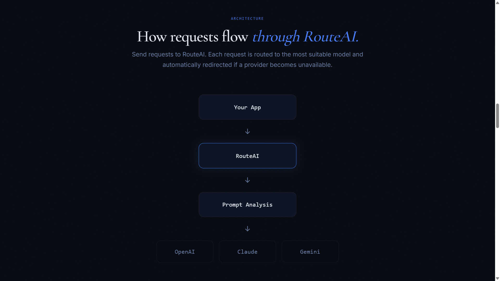
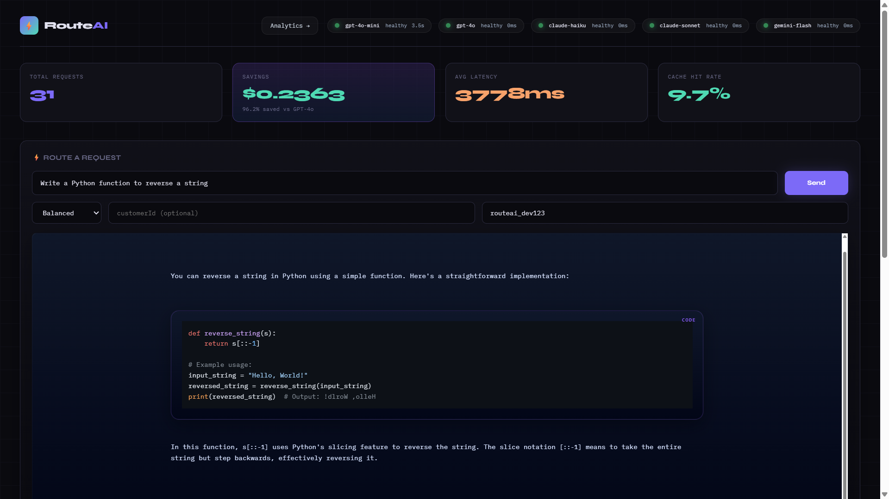
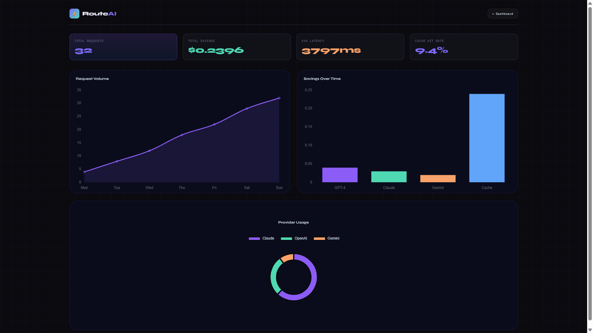
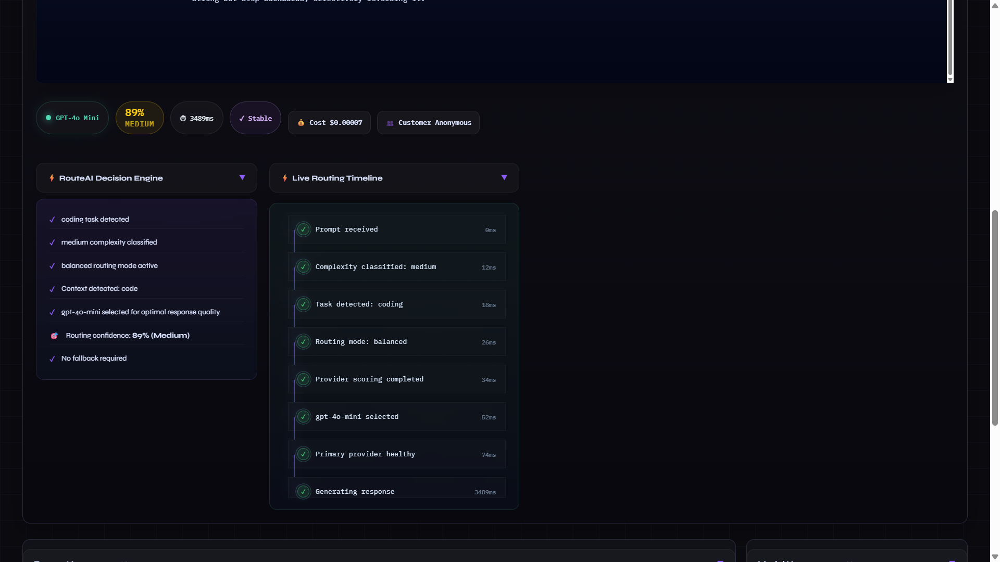

# ⚡ RouteAI

> Route every AI request through the right model.

Route every AI request through a single API.

Automatically choose the right AI model, reduce inference costs, provide automatic failover, and monitor every request through a real-time analytics dashboard.

---

### What is RouteAI?

RouteAI is an API layer that sits between your application and multiple AI providers, automatically selecting the most appropriate model for every request based on complexity, cost, speed and availability.

## 🎬 Product Demo

> The demo below shows RouteAI automatically routing requests, monitoring provider health, tracking analytics, and optimizing AI costs in real time.


---

# Why RouteAI

Most AI applications integrate directly with a single LLM provider.

While simple, this approach creates several problems:

- Higher inference costs
- Vendor lock-in
- No automatic failover
- Limited visibility into usage and spending

RouteAI acts as an intelligent routing layer between your application and multiple AI providers.

Every request is analyzed in real time, routed to the most appropriate model, and tracked through a built-in analytics dashboard.

---

# Overview

RouteAI is an AI infrastructure layer that intelligently routes requests across multiple LLM providers including:

- OpenAI
- Claude
- Gemini

It dynamically selects providers based on routing strategy, availability, latency, and fallback rules while exposing real-time analytics through a modern observability dashboard.

---

# Features

## 🧠 Smart Model Routing

Automatically route prompts across:

- GPT-4o Mini
- Claude Haiku
- Claude Sonnet
- Gemini Flash

---

## ⚡ Automatic Failover

If a provider fails, times out, or becomes unavailable:

- RouteAI retries automatically
- Switches to backup providers
- Prevents request failures

---

## 📊 Real-Time Analytics Dashboard

Monitor:

- Latency
- Token usage
- Costs
- Cache hit rate
- Errors
- Fallbacks
- Provider usage

---

## 💾 Intelligent Prompt Caching

Repeated prompts are cached to:

- Reduce latency
- Reduce API costs
- Improve response speed

---

## 🛡 Live Provider Health Monitoring

Track provider availability live:

- OpenAI
- Claude
- Gemini

---

## 🌊 Streaming Responses

Supports streamed responses for better user experience.

---

# Architecture



```text
     Your App
        │
        ▼
    RouteAI 
        │
        ▼
  Routing Engine
 ┌──────┼──────┐
 ▼      ▼      ▼
GPT   Claude  Gemini
 │      │      │
 └──────┼──────┘
        ▼
 Cache + Metrics
        ▼
 Dashboard UI
```

---

# Tech Stack

## Backend

- Node.js
- Express.js
- Axios

## Frontend

- HTML5
- CSS3
- Vanilla JavaScript

## AI Providers

- OpenAI
- Anthropic Claude
- Google Gemini

## APIs

- REST API

# Installation

## Clone Repository

```bash
git clone <your-repo-url>
cd routeai
```

---

## Install Dependencies

```bash
npm install
```

---

## Environment Variables 

Create:

```text
Create a .env file in the project root.
```

Add:

```env
OPENAI_API_KEY=your_key
ANTHROPIC_API_KEY=your_key
GEMINI_API_KEY=your_key
```

---

# Start Development Server

```bash
node index.js
```

Server starts at:

```text
http://localhost:3000
```

---

# Dashboard

Open:

```text
http://localhost:3000/dashboard.html
```

The dashboard provides:
Every request is logged with routing decisions, latency, cost, token usage and provider health.

- Request analytics
- Cost tracking
- Token usage
- Provider health
- Routing decisions
- Live request logs
- Cache hit monitoring

---

# API Usage

## POST `/api/ai`

### Request

```json
{
  "prompt":"Summarise this customer support ticket.",
  "mode":"balanced"
}
```

---

### Response

```json
{
  "provider":"claude-haiku",
  "latency":1240,
  "tokens":412,
  "cached":false,
  "cost":0.0021,
  "response":"The customer's primary issue is delayed order delivery..."
}
```

---

# Routing Modes

| Mode | Purpose |
|------|----------|
| balanced | Best overall routing |
| fast | Lowest latency |
| cheap | Lowest cost |
| quality | Best model quality |

### Routing Decision Flow

```text
Prompt
   │
   ▼
Complexity Detection
   │
   ▼
Routing Strategy
   │
   ▼
Provider Selection
   │
   ▼
Fallback (if required)
   │
   ▼
Caching
   │
   ▼
Analytics Logging
   │
   ▼
Response
```

---

# Current Capabilities

✅ Multi-provider routing

✅ Smart model selection

✅ Automatic failover

✅ Intelligent caching

✅ Provider health monitoring

✅ Cost tracking

✅ Token tracking

✅ Real-time analytics dashboard

✅ Live routing decisions

✅ Syntax highlighting

---

# Product Preview

## Dashboard Overview



---

## Live Analytics



---

## Routing Decisions



---

# Performance

Typical response latency:

| Provider     | Avg Latency | Typical Workload  |
| ------------ | ----------- | ----------------- |
| GPT-4o Mini  | ~3s         | Balanced requests |
| Claude Haiku | ~3.5s       | Code & summaries  |
| Gemini Flash | ~2–3s       | Low-cost requests |
| GPT-4o       | ~5–7s       | Complex reasoning |


---

# License

MIT License

---

# Author

Built with ❤️ by Atharva

© 2026 RouteAI